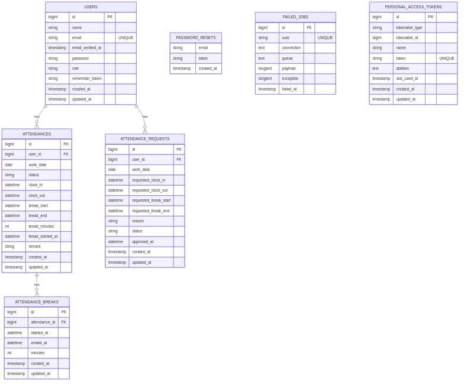

# 勤怠管理アプリ

## 環境構築
### Dockerビルド
1. git clone <リポジトリURL>
2. docker-compose up -d --build

### MySQLの設定
`/docker-compose.yml` に設定済みのため、PCに合わせて必要があれば変更してください。

### Laravel環境構築
1. docker-compose exec php bash
2. composer install
3. .env.example をコピーして .env を作成
4. php artisan key:generate
5. php artisan migrate
6. php artisan db:seed

## 使用技術(実行環境)
- PHP 8.1
- Laravel 8.75
- MySQL 8.0
- Nginx 1.21
- Docker / Docker Compose

## ER図

## URL
- 開発環境: http://localhost/
- phpMyAdmin: http://localhost:8080/
